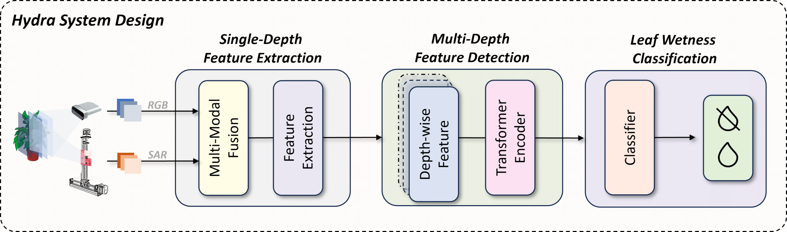

## Hydra: Accurate Multi-Modal Leaf Wetness Sensing with mm-Wave and Camera

This repository contains the dataset and model architecture of the MobiCom'24 paper "Hydra: Accurate Multi-Modal Leaf Wetness Sensing with mm-Wave and Camera".
The dataset and architecture are still under development. More content are expected by the end of September.

#### Overview

Hydra contains three main procedures: Single-Depth Feature Extraction, Multi-Depth Feature Detection, and classifier. We fuse the multi-modality and extract wetness features in the Single-Depth Feature Extraction phase. The Multi-Depth Feature Detection stage leverages these features at a 3D level, culminating in utilizing a leaf wetness classification algorithm to derive the final wetness assessment.

#### Repository structure
This repository includes the following contents:

	|- MobiCom24-Hydra
		|- dataset       - The dataset of the empirical 
  			|- RGB Image       - The RGB Camera Image
		|- model       - The model strucutre of Hydra
  			|- Hydra-Tensorflow       - Hydra model under Tensorflow
  			|- Hydra-PyTorch          - Hydra model under PyTorch
  
#### Model Requirements
The models are built using TensorFlow and PyTorch with the following versions:
	tensorflow==2.13.0
	torch==2.4.1

#### Dataset
Inside the dataset folder are two data groups: RGB and SAR images, corresponding to two different modalities. The file names within each folder are identical, representing samples captured simultaneously.

The data naming convention is divided into different segments separated by underscores (`_`):

1. **Group Status**: The first segment indicates the group, such as 'dry' (`0`) or 'wet' (`1`), representing the leaf's status.
2. **Sampling Date**: The second segment represents the sampling date.
3. **Sensor Distance**: The third segment specifies the closest distance from the plant to the sensor in millimeters.
4. **Sample Index**: The fourth segment denotes the sample index.
5. **Cross-Section Distance** (for SAR images): A fifth segment indicates the cross-section distance from the sensor.

For example
	|- dataset       - The dataset of the empirical 
 		|- RGB Image
			|- 0_0119_200_1
				|- 0_0119_200_1.jpg
   			|- ...
 		|- SAR Image
			|- 0_0119_200_1
				|- 0_0119_200_1_200.jpg

The two subfolders named `0_0119_200_1` represent data captured at the same sampling time but from two different modalities.
The file:
	dataset/RGB Image/0_0119_200_1/0_0119_200_1.jpg 
is the RGB camera image, which represents a dry leaf sample. The plant's closest point is 200mm away, and this is the 1st sample in the group taken on 01/19.
 
The file 
	dataset/SAR Image/0_0119_200_1/0_0119_200_1_200.jpg 
is the SAR image representing a dry leaf sample with the plant's closest point being 200mm away. This cross-section was captured at a 200mm distance from the sensor and belongs to the 1st sample in the group taken on 01/19.

   			

#### Reference
[1] Yimeng Liu, Maolin Gan, Huaili Zeng, Li Liu, Younsuk Dong and Zhichao Cao 2024. Hydra: Accurate Multi-Modal Leaf Wetness Sensing with mm-Wave and Camera. In Proceedings of the 30th Annual International Conference on Mobile Computing and Networking (Washington D.C. USA) (ACM MobiCom ’24). Association for Computing Machinery, New York, NY, USA, 230–245.
